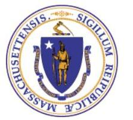

May 27, 2025 3:14 PM
Confirmation Number: 1-414-689-040

Registry of Motor Vehicles Registration Renewal 1-414-689-040

Your request to renew your vehicle registration for 2XLK35 has been successfully processed on May 27, 2025 at 3:14 PM in the Amount of $60.00.

Your registration certificate and decal will be mailed to your address on record. If your registration has expired, your vehicle cannot be operated legally until you receive your new registration certificate, unless you print and carry this e-mail in the vehicle. M.G.L. c.90 s.11 allows the RMV to issue a receipt for the fees paid, which may be carried in lieu of the registration certificate for up to 60 days.

If you do not receive your registration certificate and decal within 30 days of the renewal, or if you have questions, visit our website at www.mass.gov/rmv and select the Ask the RMV link.

Thank you for choosing Mass.Gov/RMV as your Service Center of choice.

Keep up to date with RMV updates by following us at www.twitter.com/massrmv

Massachusetts Registry of Motor Vehicles | P.O. Box 55889, Boston, MA 02205-5889 | mass.gov/rmv